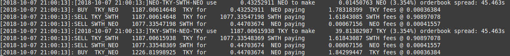

# Equalizer

Equalizer is an arbitrage bot developed by Devel484 in Python. Due to difficulties in creating and executing trades, this is only an instant win indicator. The program will not execute trades on its own until the bugs have been fixed.

The bot has a self-developed object-oriented API. It is able to link and monitor all possible exchange rates. It is constantly tried to determine an amount with which one receives the largest possible increase. As soon as exchange rates and an amount have been found, it is displayed in the console. 

The output looks like this and will only output if a profit has been found. Otherwise the output remains empty.

"[time stamp]:[pairs] use [initial amount][token] to make [absolute profit][token](%) [time spread between offer books] 
[BUY/SELL] [pair][quota amount][quota token] for [base amount][base token]] paying [amount][token] fees"

# ATTENTION!
The software has been sufficiently tested so that the calculated profit is correct, except for deviations due to rounding errors in the millionth part. This may result in Switcheo not accepting the proposed amount and having to change it manually. If this happens, simply round the amount down. Example: Purchase amount: 0.12345678 round to 0.12345670. This should make it possible to buy or sell again.  Due to unexplained reasons, the API may not provide current offers. So it can happen that the web interface of Switcheo displays the current offers while the API delivers outdated offers.
This is why neither I nor the Switcheo team are responsible for the correctness of the offers found. The user must independently check whether all listed amounts are also offered and available in the web interface. The user is exclusively liable for any losses and damages incurred.

# Use

Download the directory and unzip it. Use Python 3 to start the program: 
`python equalizer.py` 
or: 
`python3 equalizer.py` 
To view all output, even those with losses, to see that the bot is doing something, Linux users can view the end of the log files: 
`tail -f logs/mainnet/equalizer_all.txt`   
