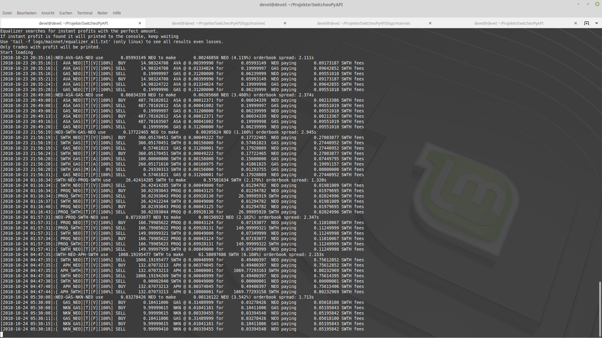

# Equalizer

Equalizer is an arbitrage bot developed by Devel484 in python 3.

The bot uses an OOP API structure which makes it possible to include other exchanges like Aphelion and NeonExchange as soon as these API allow access. 

An arbitrage bot can work in several ways. This bot continuously checks whether it is possible to make immediate profit with taker trades across three markets.

Example: Markets
Markets: 
+ `SWTH_NEO`
+ `GAS_NEO`
+ `SWTH_GAS`
 These markets can be listed in different order. Which leads to this sequence: `NEO-SWTH-GAS-NEO`. Other sequences are also considered: `NEO-SWTH-GAS-NEO`.

The user selects the start currency before the start. If the user has inserted a private key, the bot goes into full-automated mode, the private key is missing, or the bot goes into view-only mode incorrectly.
View-Only: The bot takes into account all possibilities starting with the requested start currency. As soon as a winning opportunity is found, it will be displayed on the console. No further steps will be performed.
Full-Automated: The bot takes into account all options starting with the requested start currency, including the available start currencies.

The bot was developed for a Raspberry Pi 3b and therefore does not include a user interface. That's why they work a lot with log files. These are located in the `/logs/mainnet/` folder, which is created after the first start.

| File | Contains | 
| ---------------------- |:-----------------------------------------------------------------------------------:|
| `equalizer_all.txt` | All winning chances, even with losses |
| `equalizer_almost.txt` | All winning opportunities close to making profits |
| `equalizer_win.txt` | All winning opportunities, which according to the calculation make profits |
| `execute.txt` | All virtual trades to be executed and their real equivalent |
| `executed.txt` | All winning opportunities executed |
| `send_order.txt` | The transition from trade to virtuel -> pending -> active/filled |
| `update.txt` | The ticker of the profit opportunity and the temporal difference of the markets |
| `pair.txt` | The ticker of a market and the duration of the update |
| `request.txt` | Errors that occurred during an API request |

# Attention!
The bot has only been tested on the mainnet and has already made a few NEO profits. Due to different errors that occur during execution, manual intervention by one person is currently required. Neither I nor Switcheo are liable for any losses incurred. Use at your own risk!

# Use
## Download
Download the directory and extract it to any location.
## Install dependencies
At the moment there are these dependencies: 
+base58 
+neocore 
+requests
+switcheo(from https://github.com/KeithSSmith/switcheo-python) 
By installing Switcheo all dependencies should be installed as well.
`pip install switcheo` or `pip3 install switcheo`.
## Setup
Open the file `main.py` and enter your private key at `PRIVATE_KEY="INSERT YOUR PRIVATE KEY HERE"` between the quotes. 
Use:
`python main.py` 
or: 
`python3 main.py` 
To start the bot. To view all output, even those with losses, to see that the bot is doing something, Linux users can view the end of the log files. Also working with SSH: 
`tail -f logs/mainnet/equalizer_all.txt`   

# Statistics
A executable version has been tested daily since 18.10.18 and has achieved the following until today 10.11.18.
 NEO Address: `AdZ2fAigCJHESy2cZAXAz8Ts4ZGgsohZ65`

| Achievement | Achieved | Place |
| :---------------------: |:---------------------------: | :---------------------------: |
| Days of use             | 23                           | -                             |
| Uptime                  | ~70%                         | -                             |    
| Total Trades            | 459                          | 2                             |
| Taker Trades            | 444                          | 1                             |
| Maker Trades            | 15                           | -                             |    
| Total Trade Amount      | 63.019.803.625.647           | 43                            |
| Paided fees(SWTH)       | 1.498,549                    | 16                            |
| Total Win               | ~10 NEO                      | -                             |

Sources: https://switcheolytics.tech/ and http://switchstatistic.000webhostapp.com/

# TODO
+ The bot can still be repaired in many places:
+ Automatic troubleshooting during the execution of winnings
+ Optimize API accesses
+ Arbitrage with Maker Trades
+ Arbitrage with other Exchanges (planned Aphelion and NeonExchange)
+ create automatic statistics
+ CSV export for tax statement
+ Telegram integration for control and notification

